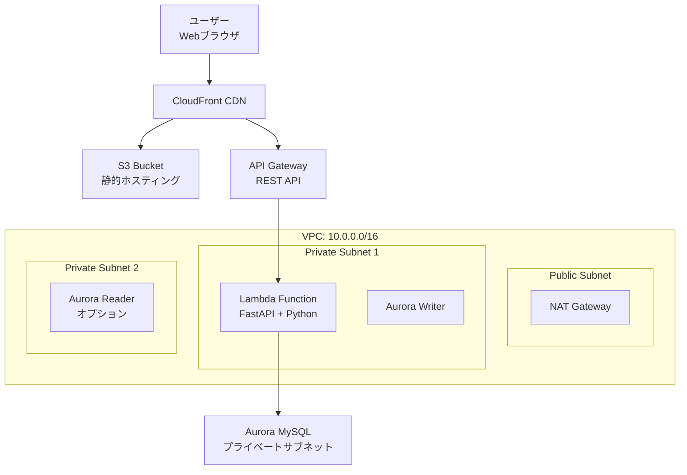
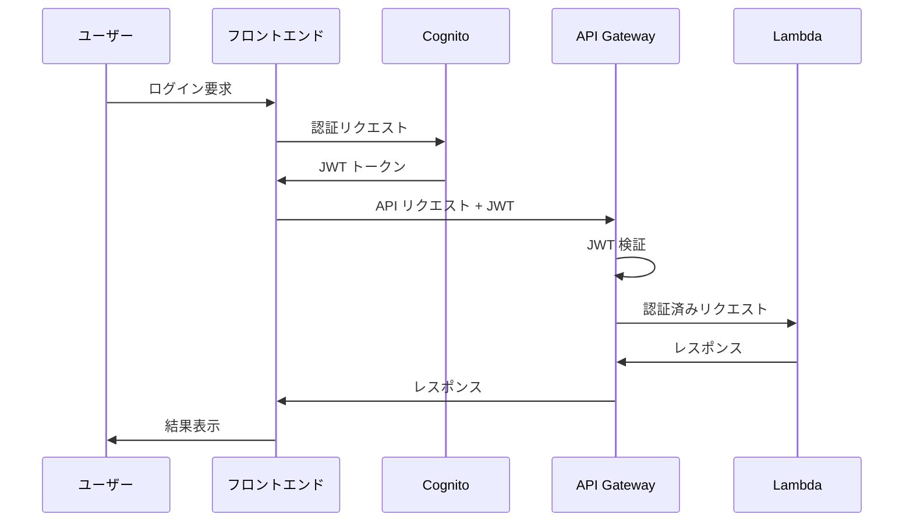

# 設計書

## 概要

CSR + Lambda API システムは、AWS 上でサーバーレスアーキテクチャを採用した Web アプリケーションです。フロントエンドは Next.js（CSR モード）、バックエンドは FastAPI + Lambda で構築し、グローバル配信とスケーラビリティを実現します。

## アーキテクチャ

### システム全体構成



### レイヤー構成

1. **プレゼンテーション層**: CloudFront + S3（静的コンテンツ）
2. **アプリケーション層**: Next.js CSR（ブラウザ実行）
3. **API 層**: API Gateway + Lambda（FastAPI）
4. **データ層**: Aurora MySQL（VPC 内）

## コンポーネントと インターフェース

### フロントエンド コンポーネント

#### Next.js CSR アプリケーション

- **技術スタック**: Next.js 14, React 18, TypeScript
- **レンダリング**: Client-Side Rendering
- **状態管理**: React Context API / Zustand
- **HTTP クライアント**: Axios / Fetch API
- **認証**: AWS Amplify Auth (Cognito 連携)

````typescript
// API クライアント インターフェース
interface ApiClient {
  get<T>(endpoint: string, config?: RequestConfig): Promise<T>
  post<T>(endpoint: string, data: any, config?: RequestConfig): Promise<T>
  put<T>(endpoint: string, data: any, config?: RequestConfig): Promise<T>
  delete<T>(endpoint: string, config?: RequestConfig): Promise<T>
}

// 認証コンテキスト
interface AuthContext {
  user: User | null
  isAuthenticated: boolean
  login: (credentials: LoginCredentials) => Promise<void>
  logout: () => Promise<void>
  getToken: () => Promise<string | null></string>### 静的アセット配信
- **S3 バケット設定**:
  - バケット名: `{project-name}-frontend-{env}`
  - 静的ウェブサイトホスティング有効
  - パブリック読み取りアクセス
  - バージョニング有効

### バックエンド コンポーネント

#### API Gateway 設定
```yaml
# API Gateway 設定例
Resources:
  - Resource: /api/v1/users
    Methods: [GET, POST, PUT, DELETE]
    Authorization: AWS_IAM (Cognito)

  - Resource: /api/v1/auth
    Methods: [POST]
    Authorization: None (ログイン用)

  - Resource: /api/v1/health
    Methods: [GET]
    Authorization: None
````

#### Lambda Function アーキテクチャ

```python
# FastAPI アプリケーション構造
from fastapi import FastAPI, Depends
from mangum import Mangum

app = FastAPI(title="CSR Lambda API", version="1.0.0")

# ルーター構成
app.include_router(auth_router, prefix="/api/v1/auth", tags=["認証"])
app.include_router(users_router, prefix="/api/v1/users", tags=["ユーザー"])
app.include_router(health_router, prefix="/api/v1/health", tags=["ヘルスチェック"])

# Lambda ハンドラー
handler = Mangum(app)
```

#### データベース設計

```sql
-- ユーザーテーブル
CREATE TABLE users (
    id BIGINT PRIMARY KEY AUTO_INCREMENT,
    cognito_user_id VARCHAR(255) UNIQUE NOT NULL,
    email VARCHAR(255) UNIQUE NOT NULL,
    username VARCHAR(100) NOT NULL,
    created_at TIMESTAMP DEFAULT CURRENT_TIMESTAMP,
    updated_at TIMESTAMP DEFAULT CURRENT_TIMESTAMP ON UPDATE CURRENT_TIMESTAMP,
    INDEX idx_cognito_user_id (cognito_user_id),
    INDEX idx_email (email)
);

-- プロファイルテーブル
CREATE TABLE user_profiles (
    id BIGINT PRIMARY KEY AUTO_INCREMENT,
    user_id BIGINT NOT NULL,
    first_name VARCHAR(100),
    last_name VARCHAR(100),
    avatar_url VARCHAR(500),
    bio TEXT,
    created_at TIMESTAMP DEFAULT CURRENT_TIMESTAMP,
    updated_at TIMESTAMP DEFAULT CURRENT_TIMESTAMP ON UPDATE CURRENT_TIMESTAMP,
    FOREIGN KEY (user_id) REFERENCES users(id) ON DELETE CASCADE
);
```

## データモデル

### API データモデル

```python
from pydantic import BaseModel, EmailStr
from typing import Optional
from datetime import datetime

class UserBase(BaseModel):
    email: EmailStr
    username: str

class UserCreate(UserBase):
    password: str

class UserResponse(UserBase):
    id: int
    cognito_user_id: str
    created_at: datetime
    updated_at: datetime

    class Config:
        from_attributes = True

class UserProfileResponse(BaseModel):
    id: int
    user_id: int
    first_name: Optional[str]
    last_name: Optional[str]
    avatar_url: Optional[str]
    bio: Optional[str]
```

### フロントエンド データモデル

```typescript
// ユーザー関連の型定義
export interface User {
  id: number;
  cognitoUserId: string;
  email: string;
  username: string;
  createdAt: string;
  updatedAt: string;
}

export interface UserProfile {
  id: number;
  userId: number;
  firstName?: string;
  lastName?: string;
  avatarUrl?: string;
  bio?: string;
}

// API レスポンス型
export interface ApiResponse<T> {
  data: T;
  message?: string;
  status: "success" | "error";
}
```

## エラーハンドリング

### API エラーレスポンス標準化

```python
from fastapi import HTTPException
from pydantic import BaseModel

class ErrorResponse(BaseModel):
    error_code: str
    message: str
    details: Optional[dict] = None

# カスタム例外クラス
class BusinessLogicError(HTTPException):
    def __init__(self, error_code: str, message: str, details: dict = None):
        self.error_code = error_code
        super().__init__(status_code=400, detail={
            "error_code": error_code,
            "message": message,
            "details": details
        })
```

### フロントエンド エラーハンドリング

```typescript
// エラーハンドリング ユーティリティ
export class ApiError extends Error {
  constructor(public errorCode: string, public message: string, public statusCode: number, public details?: any) {
    super(message);
  }
}

// API クライアント エラーハンドリング
export const handleApiError = (error: any): ApiError => {
  if (error.response?.data) {
    const { error_code, message, details } = error.response.data;
    return new ApiError(error_code, message, error.response.status, details);
  }
  return new ApiError("UNKNOWN_ERROR", "An unexpected error occurred", 500);
};
```

## テスト戦略

### バックエンド テスト

1. **単体テスト**: pytest + FastAPI TestClient

```python
import pytest
from fastapi.testclient import TestClient
from app.main import app

client = TestClient(app)

def test_get_users():
    response = client.get("/api/v1/users")
    assert response.status_code == 200
    assert "data" in response.json()
```

2. **統合テスト**: Docker Compose + テスト用 Aurora
3. **E2E テスト**: Lambda 関数の実際のデプロイメント環境でのテスト

### フロントエンド テスト

1. **単体テスト**: Jest + React Testing Library

```typescript
import { render, screen } from "@testing-library/react";
import { UserProfile } from "@/components/UserProfile";

test("renders user profile", () => {
  const user = { id: 1, username: "testuser", email: "test@example.com" };
  render(<UserProfile user={user} />);
  expect(screen.getByText("testuser")).toBeInTheDocument();
});
```

2. **統合テスト**: Cypress / Playwright
3. **視覚回帰テスト**: Storybook + Chromatic

### インフラストラクチャ テスト

1. **IaC テスト**: CloudFormation / CDK テンプレートの検証
2. **セキュリティテスト**: AWS Config Rules
3. **パフォーマンステスト**: Artillery.js でのロードテスト

## 日本語開発標準

### コーディング規約

#### コメント記述標準

```python
# バックエンド（Python）のコメント例
class UserService:
    """ユーザー管理サービス

    ユーザーの作成、更新、削除、検索機能を提供する
    """

    def create_user(self, user_data: UserCreate) -> User:
        """新規ユーザーを作成する

        Args:
            user_data: ユーザー作成データ

        Returns:
            User: 作成されたユーザー情報

        Raises:
            ValidationError: バリデーションエラーが発生した場合
            DatabaseError: データベースエラーが発生した場合
        """
        # メールアドレスの重複チェック
        if self.repository.exists_by_email(user_data.email):
            raise ValidationError("このメールアドレスは既に使用されています")

        # パスワードのハッシュ化
        hashed_password = self.hash_password(user_data.password)

        return self.repository.create(user_data, hashed_password)
```

```typescript
// フロントエンド（TypeScript）のコメント例
/**
 * ユーザー管理API クライアント
 *
 * ユーザーの CRUD 操作を提供する
 */
export class UserApiClient {
  /**
   * ユーザー一覧を取得する
   *
   * @param params 検索パラメータ
   * @returns ユーザー一覧のPromise
   */
  async getUsers(params?: UserSearchParams): Promise<User[]> {
    // クエリパラメータの構築
    const queryString = this.buildQueryString(params);

    // API リクエストの実行
    const response = await this.httpClient.get(`/users${queryString}`);

    return response.data;
  }
}
```

#### エラーメッセージ標準

```python
# バックエンドエラーメッセージ（日本語）
ERROR_MESSAGES = {
    "USER_NOT_FOUND": "指定されたユーザーが見つかりません",
    "EMAIL_ALREADY_EXISTS": "このメールアドレスは既に使用されています",
    "INVALID_PASSWORD": "パスワードが正しくありません",
    "TOKEN_EXPIRED": "認証トークンの有効期限が切れています",
    "INSUFFICIENT_PERMISSIONS": "この操作を実行する権限がありません",
    "DATABASE_CONNECTION_ERROR": "データベースへの接続に失敗しました",
    "VALIDATION_ERROR": "入力データに不正な値が含まれています"
}
```

```typescript
// フロントエンドエラーメッセージ（日本語）
export const ERROR_MESSAGES = {
  NETWORK_ERROR: "ネットワークエラーが発生しました。しばらく時間をおいて再度お試しください。",
  UNAUTHORIZED: "ログインが必要です。",
  FORBIDDEN: "この操作を実行する権限がありません。",
  NOT_FOUND: "指定されたリソースが見つかりません。",
  VALIDATION_ERROR: "入力内容に誤りがあります。",
  SERVER_ERROR: "サーバーエラーが発生しました。管理者にお問い合わせください。",
} as const;
```

#### ログ出力標準

```python
# 構造化ログ（日本語メッセージ）
import logging
from typing import Dict, Any

logger = logging.getLogger(__name__)

def log_user_action(action: str, user_id: int, details: Dict[str, Any] = None):
    """ユーザーアクションをログに記録する"""
    logger.info(
        f"ユーザーアクション実行: {action}",
        extra={
            "action": action,
            "user_id": user_id,
            "details": details or {},
            "timestamp": datetime.utcnow().isoformat()
        }
    )

# 使用例
log_user_action("ユーザー作成", user_id=123, details={"email": "user@example.com"})
log_user_action("ログイン成功", user_id=456)
```

#### データベーススキーマ標準

```sql
-- テーブル名・カラム名は英語、コメントは日本語
CREATE TABLE users (
    id BIGINT PRIMARY KEY AUTO_INCREMENT COMMENT 'ユーザーID（主キー）',
    cognito_user_id VARCHAR(255) UNIQUE NOT NULL COMMENT 'Cognito ユーザーID',
    email VARCHAR(255) UNIQUE NOT NULL COMMENT 'メールアドレス',
    username VARCHAR(100) NOT NULL COMMENT 'ユーザー名',
    created_at TIMESTAMP DEFAULT CURRENT_TIMESTAMP COMMENT '作成日時',
    updated_at TIMESTAMP DEFAULT CURRENT_TIMESTAMP ON UPDATE CURRENT_TIMESTAMP COMMENT '更新日時',

    INDEX idx_cognito_user_id (cognito_user_id) COMMENT 'Cognito ユーザーID インデックス',
    INDEX idx_email (email) COMMENT 'メールアドレス インデックス'
) COMMENT 'ユーザー情報テーブル';

CREATE TABLE user_profiles (
    id BIGINT PRIMARY KEY AUTO_INCREMENT COMMENT 'プロファイルID（主キー）',
    user_id BIGINT NOT NULL COMMENT 'ユーザーID（外部キー）',
    first_name VARCHAR(100) COMMENT '名前',
    last_name VARCHAR(100) COMMENT '姓',
    avatar_url VARCHAR(500) COMMENT 'アバター画像URL',
    bio TEXT COMMENT '自己紹介',
    created_at TIMESTAMP DEFAULT CURRENT_TIMESTAMP COMMENT '作成日時',
    updated_at TIMESTAMP DEFAULT CURRENT_TIMESTAMP ON UPDATE CURRENT_TIMESTAMP COMMENT '更新日時',

    FOREIGN KEY (user_id) REFERENCES users(id) ON DELETE CASCADE COMMENT 'ユーザーテーブルへの外部キー'
) COMMENT 'ユーザープロファイル情報テーブル';
```

### API ドキュメント標準

```python
# FastAPI での日本語ドキュメント例
from fastapi import FastAPI, HTTPException
from pydantic import BaseModel, Field

app = FastAPI(
    title="CSR Lambda API システム",
    description="クライアントサイドレンダリング Web アプリケーション用 API",
    version="1.0.0"
)

class UserResponse(BaseModel):
    """ユーザー情報レスポンス"""
    id: int = Field(..., description="ユーザーID")
    email: str = Field(..., description="メールアドレス")
    username: str = Field(..., description="ユーザー名")
    created_at: str = Field(..., description="作成日時（ISO 8601 形式）")

@app.get(
    "/api/v1/users/{user_id}",
    response_model=UserResponse,
    summary="ユーザー情報取得",
    description="指定されたユーザーIDのユーザー情報を取得します",
    responses={
        200: {
            "description": "ユーザー情報の取得に成功",
            "content": {
                "application/json": {
                    "example": {
                        "id": 1,
                        "email": "user@example.com",
                        "username": "サンプルユーザー",
                        "created_at": "2024-01-01T00:00:00Z"
                    }
                }
            }
        },
        404: {
            "description": "ユーザーが見つかりません",
            "content": {
                "application/json": {
                    "example": {
                        "error_code": "USER_NOT_FOUND",
                        "message": "指定されたユーザーが見つかりません"
                    }
                }
            }
        }
    }
)
async def get_user(user_id: int):
    """ユーザー情報を取得する"""
    # 実装内容...
```

## セキュリティ設計

### 認証・認可フロー



### セキュリティ対策

1. **通信暗号化**: 全て HTTPS/TLS 1.2 以上
2. **認証**: AWS Cognito JWT トークン
3. **認可**: API Gateway + Lambda オーソライザー
4. **ネットワーク分離**: VPC + プライベートサブネット
5. **データ暗号化**: Aurora 暗号化有効
6. **アクセス制御**: IAM ロール最小権限の原則

### セキュリティグループ設定

```yaml
# Lambda セキュリティグループ
LambdaSecurityGroup:
  Type: AWS::EC2::SecurityGroup
  Properties:
    GroupDescription: Lambda function security group
    VpcId: !Ref VPC
    SecurityGroupEgress:
      - IpProtocol: -1
        CidrIp: 0.0.0.0/0

# Aurora セキュリティグループ
AuroraSecurityGroup:
  Type: AWS::EC2::SecurityGroup
  Properties:
    GroupDescription: Aurora MySQL security group
    VpcId: !Ref VPC
    SecurityGroupIngress:
      - IpProtocol: tcp
        FromPort: 3306
        ToPort: 3306
        SourceSecurityGroupId: !Ref LambdaSecurityGroup
```

## パフォーマンス最適化

### フロントエンド最適化

1. **コード分割**: Next.js dynamic imports
2. **画像最適化**: Next.js Image コンポーネント
3. **キャッシング**: CloudFront + ブラウザキャッシュ
4. **バンドル最適化**: Webpack tree shaking

### バックエンド最適化

1. **Lambda コールドスタート対策**:

   - Provisioned Concurrency（本番環境）
   - 軽量なランタイム依存関係
   - 接続プール最適化

2. **データベース最適化**:
   - 適切なインデックス設計
   - クエリ最適化
   - 接続プール管理

### 監視とメトリクス

```python
# CloudWatch カスタムメトリクス
import boto3

cloudwatch = boto3.client('cloudwatch')

def put_custom_metric(metric_name: str, value: float, unit: str = 'Count'):
    cloudwatch.put_metric_data(
        Namespace='CSR-Lambda-API',
        MetricData=[
            {
                'MetricName': metric_name,
                'Value': value,
                'Unit': unit
            }
        ]
    )
```

## デプロイメント設計

### CI/CD パイプライン

```yaml
# CodePipeline 設定
Stages:
  - Name: Source
    Actions:
      - Name: SourceAction
        ActionTypeId:
          Category: Source
          Owner: ThirdParty
          Provider: GitHub

  - Name: Build
    Actions:
      - Name: BuildFrontend
        ActionTypeId:
          Category: Build
          Owner: AWS
          Provider: CodeBuild
      - Name: BuildBackend
        ActionTypeId:
          Category: Build
          Owner: AWS
          Provider: CodeBuild

  - Name: Deploy
    Actions:
      - Name: DeployInfrastructure
        ActionTypeId:
          Category: Deploy
          Owner: AWS
          Provider: CloudFormation
```

### 環境分離

1. **開発環境**:

   - Aurora Serverless v2 (最小構成)
   - Lambda 128MB メモリ
   - CloudFront 無効

2. **ステージング環境**:

   - Aurora t3.small
   - Lambda 512MB メモリ
   - CloudFront 有効

3. **本番環境**:
   - Aurora t3.medium + Read Replica
   - Lambda 1024MB メモリ + Provisioned Concurrency
   - CloudFront + WAF
