# CI/CD パイプライン設定ガイド

## 概要

CSR Lambda API システムの CI/CD パイプラインは、GitHub Actions を使用して環境別の自動デプロイメントを実現します。開発、ステージング、本番環境それぞれに最適化されたパイプラインを提供し、品質保証とセキュリティを確保します。

## アーキテクチャ

### パイプライン構成

```mermaid
graph TB
    subgraph "開発環境 (dev)"
        A[develop ブランチ] --> B[テスト実行]
        B --> C[ビルド]
        C --> D[開発環境デプロイ]
    end

    subgraph "ステージング環境 (staging)"
        E[main ブランチ] --> F[包括的テスト]
        F --> G[セキュリティスキャン]
        G --> H[ビルド]
        H --> I[ステージング環境デプロイ]
        I --> J[統合テスト]
    end

    subgraph "本番環境 (prod)"
        K[手動トリガー] --> L[厳格テスト]
        L --> M[セキュリティ監査]
        M --> N[本番ビルド]
        N --> O[手動承認]
        O --> P[ブルーグリーンデプロイ]
        P --> Q[監視・ロールバック]
    end
```



## 環境別設定

### 開発環境 (dev)

**トリガー**: `develop` ブランチへのプッシュ
**特徴**:

- 高速デプロイメント
- 基本的なテストのみ
- S3 静的ホスティング
- Lambda 最小構成

**ワークフロー**: `.github/workflows/dev-deploy.yml`

```yaml
# 主要ステップ
1. テストとビルド検証
2. インフラストラクチャデプロイ
3. バックエンドデプロイ
4. フロントエンドデプロイ
5. ヘルスチェック
```

### ステージング環境 (staging)

**トリガー**: `main` ブランチへのプッシュ
**特徴**:

- 包括的テストスイート
- セキュリティスキャン
- CloudFront 配信
- 本番類似構成

**ワークフロー**: `.github/workflows/staging-deploy.yml`

```yaml
# 主要ステップ
1. 包括的テストとセキュリティスキャン
2. インフラストラクチャデプロイ
3. 最適化ビルド
4. バックエンドデプロイ
5. フロントエンドデプロイ
6. CloudFront 無効化
7. 統合テスト
```

### 本番環境 (prod)

**トリガー**: 手動実行 (workflow_dispatch)
**特徴**:

- 厳格なテストと監査
- 手動承認ゲート
- ブルーグリーンデプロイ
- 段階的ロールアウト
- 自動ロールバック

**ワークフロー**: `.github/workflows/prod-deploy.yml`

```yaml
# 主要ステップ
1. デプロイ前チェック
2. 本番環境用厳格テスト
3. セキュリティ監査
4. 本番最適化ビルド
5. 手動承認待機
6. ブルーグリーンデプロイ
7. 段階的ロールアウト (10% → 100%)
8. 統合テスト・監視
```

## セットアップ手順

### 1. GitHub Secrets の設定

リポジトリの Settings > Secrets and variables > Actions で以下を設定:

```bash
# AWS 認証情報
AWS_ACCESS_KEY_ID=AKIA...
AWS_SECRET_ACCESS_KEY=...

# オプション: 通知設定
SLACK_WEBHOOK_URL=https://hooks.slack.com/...
```

### 2. AWS IAM ロールの設定

CI/CD 用の IAM ユーザーまたはロールに以下の権限を付与:

```json
{
  "Version": "2012-10-17",
  "Statement": [
    {
      "Effect": "Allow",
      "Action": ["cloudformation:*", "s3:*", "lambda:*", "apigateway:*", "cloudfront:*", "rds:*", "ec2:*", "iam:*", "logs:*", "cloudwatch:*"],
      "Resource": "*"
    }
  ]
}
```

### 3. 環境別パラメータの設定

各環境のパラメータファイルを確認・更新:

```bash
# 開発環境
infrastructure/dev/parameters.json

# ステージング環境
infrastructure/staging/parameters.json

# 本番環境
infrastructure/prod/parameters.json
```

## 使用方法

### 開発環境デプロイ

```bash
# develop ブランチにプッシュするだけで自動実行
git checkout develop
git add .
git commit -m "feat: 新機能を追加"
git push origin develop
```

### ステージング環境デプロイ

```bash
# main ブランチにマージするだけで自動実行
git checkout main
git merge develop
git push origin main
```

### 本番環境デプロイ

1. GitHub の Actions タブに移動
2. "Deploy to Production" ワークフローを選択
3. "Run workflow" をクリック
4. パラメータを入力:
   - **version**: デプロイするバージョン
   - **rollback**: ロールバック実行 (true/false)
   - **skip_tests**: テストスキップ (緊急時のみ)

### ロールバック実行

#### GitHub Actions 経由

```bash
# 本番環境ワークフローでロールバックオプションを有効化
rollback: true
```

#### スクリプト経由

```bash
# 緊急ロールバック
./scripts/rollback.sh prod --confirm

# Lambda のみロールバック
./scripts/rollback.sh prod --lambda-only --to-version 5

# フロントエンドのみロールバック
./scripts/rollback.sh prod --frontend-only
```

## 監視とアラート

### デプロイメント監視

```bash
# 本番環境の監視 (10分間)
./scripts/monitor-deployment.sh prod

# 継続監視
./scripts/monitor-deployment.sh prod --continuous

# カスタム設定
./scripts/monitor-deployment.sh prod --duration 30 --interval 60 --alert-threshold 5
```

### システム状態確認

```bash
# 現在の状態確認
./scripts/rollback.sh prod --status

# Lambda バージョン一覧
./scripts/rollback.sh prod --list-versions
```

## ビルド設定

### CodeBuild 仕様

各環境用の buildspec ファイル:

- `buildspec-dev.yml`: 開発環境用
- `buildspec-staging.yml`: ステージング環境用
- `buildspec-prod.yml`: 本番環境用

### ローカルビルド・デプロイ

```bash
# 統合ビルド・デプロイスクリプト
./scripts/build-and-deploy.sh dev

# フロントエンドのみ
./scripts/build-and-deploy.sh staging --frontend-only

# ビルドのみ
./scripts/build-and-deploy.sh prod --build-only
```

## セキュリティ

### セキュリティスキャン

各環境で実行されるセキュリティチェック:

**開発環境**:

- 基本的な依存関係チェック

**ステージング環境**:

- Safety (Python セキュリティ)
- Bandit (Python 静的解析)
- npm audit (Node.js セキュリティ)

**本番環境**:

- 厳格なセキュリティ監査
- 脆弱性スキャン
- コンプライアンスチェック

### 認証情報管理

- AWS 認証情報は GitHub Secrets で管理
- 環境変数での機密情報の取り扱い
- IAM ロールの最小権限原則

## トラブルシューティング

### よくある問題

#### 1. デプロイメント失敗

```bash
# ログの確認
# GitHub Actions の詳細ログを確認

# 手動でのインフラ確認
aws cloudformation describe-stacks --stack-name csr-lambda-api-prod-api

# ロールバック実行
./scripts/rollback.sh prod --confirm
```

#### 2. Lambda 関数エラー

```bash
# Lambda ログの確認
aws logs describe-log-groups --log-group-name-prefix "/aws/lambda/csr-lambda-api"

# 関数の直接テスト
aws lambda invoke --function-name csr-lambda-api-prod-api-function test-output.json
```

#### 3. CloudFront キャッシュ問題

```bash
# 手動でキャッシュ無効化
aws cloudfront create-invalidation --distribution-id E1234567890 --paths "/*"
```

### デバッグモード

環境変数でデバッグを有効化:

```bash
export DEBUG=true
./scripts/build-and-deploy.sh dev
```

## パフォーマンス最適化

### ビルド時間短縮

- Docker レイヤーキャッシュの活用
- 依存関係キャッシュの最適化
- 並列ビルドの実装

### デプロイメント最適化

- 増分デプロイメント
- Lambda レイヤーの活用
- CloudFront キャッシュ戦略

## 拡張機能

### 通知設定

Slack 通知の設定例:

```yaml
- name: Slack 通知
  if: always()
  uses: 8398a7/action-slack@v3
  with:
    status: ${{ job.status }}
    webhook_url: ${{ secrets.SLACK_WEBHOOK_URL }}
```

### カスタムメトリクス

CloudWatch カスタムメトリクスの追加:

```python
import boto3

def put_deployment_metric(metric_name, value):
    cloudwatch = boto3.client('cloudwatch')
    cloudwatch.put_metric_data(
        Namespace='CSR-Lambda-API/Deployment',
        MetricData=[{
            'MetricName': metric_name,
            'Value': value,
            'Unit': 'Count'
        }]
    )
```

## ベストプラクティス

### コミット規約

```bash
# 機能追加
feat: ユーザー認証機能を追加

# バグ修正
fix: ログイン時のバリデーションエラーを修正

# ドキュメント更新
docs: API仕様書を更新

# リファクタリング
refactor: ユーザーサービスをリファクタリング
```

### ブランチ戦略

```
main (本番)
├── develop (開発)
├── feature/user-auth (機能開発)
├── hotfix/critical-bug (緊急修正)
└── release/v1.2.0 (リリース準備)
```

### テスト戦略

- **単体テスト**: 各コンポーネントの個別テスト
- **統合テスト**: API とデータベースの連携テスト
- **E2E テスト**: ユーザーシナリオの完全テスト
- **パフォーマンステスト**: 負荷テストとレスポンス時間測定

## 参考資料

- [AWS CodePipeline ユーザーガイド](https://docs.aws.amazon.com/codepipeline/)
- [GitHub Actions ドキュメント](https://docs.github.com/en/actions)
- [AWS Lambda ベストプラクティス](https://docs.aws.amazon.com/lambda/latest/dg/best-practices.html)
- [CloudFormation テンプレートリファレンス](https://docs.aws.amazon.com/AWSCloudFormation/latest/UserGuide/)

## サポート

問題が発生した場合は、以下の手順で対応してください:

1. GitHub Actions のログを確認
2. AWS CloudFormation スタックの状態を確認
3. 必要に応じてロールバックを実行
4. 開発チームに報告

---

**注意**: 本番環境への変更は慎重に行い、必ずステージング環境での検証を完了してから実行してください。
